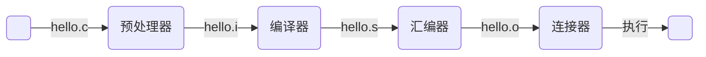

# CSAPP总结

## 前言

CSAPP（中文名深入计算机系统）是一本以C语言为例的，从程序运行的视角带你深入了解计算机的运行原理的专业类书籍。这本书所涉及的知识面相当全面，阐述原理的本质，是计算机专业基本著名的“圣经”之一。

本篇文章是对CSAPP主要知识点进行总结。作者并不建议初学者阅读这篇总结，因为直接阅读本文容易陷入知其然不知其所以然的泥潭，更建议按照原文内容去构建一个更加完整的知识体系。（要相信原书作者截止目前3个版本的迭代和二十余年卡内基梅隆的教学经验和全世界数多计算机专业教学反馈）

本篇文章的建议食用方式是在阅读完原文后，阅读本文能对所有总结出来的知识点有“就是这样”的回味，亦可作为工具手册或“温故而知新”的简本。为此本篇文章也将按照原文的章节顺序进行知识点的总结。

## 一、计算机系统漫游

**数据的基础单元是bit（位），其值为0或1。计算机系统的基本内存单元是byte（字节），由8个连续的bit组成。**

**所有计算机系统中存储的信息（数据）都是一些了bit的集合。** 为了区别他们，我们定义了多种多样的数据格式（常常用不同的文件后缀去标记不同的文件，如.txt的文本，.jpg的图），当我们以不同方式去读取并处理这一系列bit，他们就成为了不同信息：图片的bit集合给屏幕会显示我们能理解的图像，音频的bit集合给音箱会放出有意义的声音。

******

```c
//hello.c
#include <stdio.h>
int main()
{
    printf("hello,world\n");
    return 0;
}
```

从*hello.c*文本到可执行程序要经历：预处理、编译、汇编、链接。



**预处理** 处理c语言中#开头的命令：导入头文件内容，处理宏定义等

**编译** c语言转汇编语言

**汇编** 汇编语言转指令并生成*可重定位目标程序*（后文补充），即.o文件

**链接** 多个.o文件链接成一个可执行目标文件

---

计算机系统的基本组成:

**总线** 传递信息的电子管道

**I/O设备** 系统与外界的联系通道

**主存** 存放程序和数据的存储单元

**处理器** 解释/执行主存中的计算指令


---

存储空间更大的设备读写数据开销的时间越大，反之开销越小。程序及数据在存储单元中有局部性特点（即存储单元局部空间的数据和指令在执行顺序上也更接近）。基于上述两个特点计算机系统设计了多级缓存原理。


---

**操作系统** 是软件和硬件之间的耦合层，本身也是一种软件。所有应用程序对硬件的操作尝试都必须通过操作系统。

操作系统的两个基本功能：

1. 防止硬件被失控的应用程序滥用

2. 向应用程序提供简单一致的机制来控制复杂而又通常大不相同的低级硬件设备

---

**进程** 是操作系统对一个正在运行的程序的一种抽象。

常见的通用计算系统都分时运行的，多个进程在操作系统上以极快速度的分时占用cpu进行计算，形成了一种多程序并发运行的假象，实际上是一个cpu在同一时刻只能运行一个进程，当需要切换另一个进程的时候会将当前进程的上下文（即进程运行所需要的状态信息，如PC和寄存器的值，主存信息等）保存，再切换到另一个进程并依据其上下文继续执行。

---

**线程** 是进程中的一个执行单元。进程有多个线程组成，多个线程共享进程的上下文。因此多线程之间的切换不需要切换上下文，因此执行更高效，缺陷是要由程序员小心的控制线程对上下文的修改避免线程间冲突。

---

**Amdahl定律**：当我们对系统的某部分加速时，其对系统整体性能的影响取决于该部分的重要性和加速程度。

假设系统执行某应用程序需要时间为$T_{old}$，假设系统某部分所需执行时间的比例为$\alpha$，而该部分性能提升比例为$k$。因此总的执行时间$T_{new}$

$T_{new} = (1-\alpha)T_{old} + (\alpha T_{old})/k = T_{old}[(1- \alpha) + \alpha / k]$

计算出加速比$S$为

$ S= T_{old}/T_{new} = \frac{1}{(1- \alpha)+\alpha/k}$

---

---

---

---

## 七、链接

**链接由链接器完成，使分离编译（separate compilation）成为可能。** 分离编译使得大型项目可以由多个小模块构建，而当我们改变其源码时可以仅编译其源码所属的小模块，避免全项目编译。
