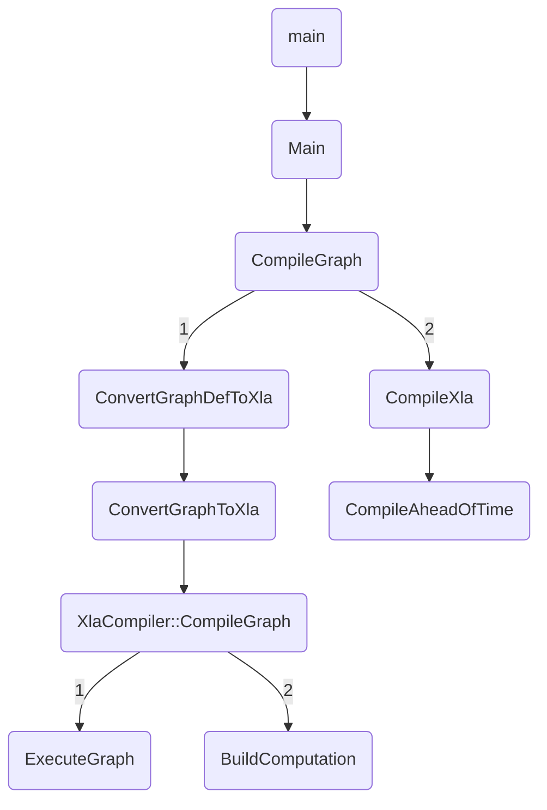
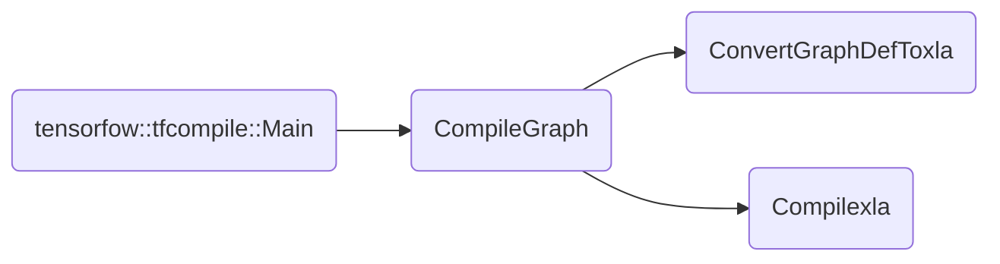

# Preface

This file describe the procedure of tensorflow's xla compilation. 

Author: Yunheng Jiang

Email: jiangyunheng@eswin.com

<div style="page-break-after:always;"></div>

# Content

[TOC]

<div style="page-break-after:always;"></div>

# I Procedure of xla compilation[👆](#Content)




  */tensorflow/tensorflow/compiler/aot/BUILD*      [`tfcompile_main`](#1. tfcompile_main.cc[👆](#Content)) is the main entry.

```bazel
tf_cc_binary(
    name = "tfcompile",
    visibility = ["//visibility:public"],
    deps = [":tfcompile_main"],
)
cc_library(
    name = "tfcompile_main",
    srcs = ["tfcompile_main.cc"],
    visibility = ["//visibility:public"],
    deps = [
        ":tfcompile_lib",
        "//tensorflow/compiler/tf2xla:tf2xla_proto_cc",
        "//tensorflow/compiler/tf2xla:tf2xla_util",
        "//tensorflow/compiler/xla:debug_options_flags",
        "//tensorflow/compiler/xla/service:compiler",
        "//tensorflow/core:core_cpu",
        "//tensorflow/core:core_cpu_internal",
        "//tensorflow/core:framework",
        "//tensorflow/core:framework_internal",
        "//tensorflow/core:graph",
        "//tensorflow/core:lib",
        "//tensorflow/core:protos_all_cc",
        "@com_google_absl//absl/strings",
    ],
)
cc_library(
    name = "tfcompile_lib",
    srcs = [
        "codegen.cc",
        "compile.cc",
        "flags.cc",
    ],
    hdrs = [
        "codegen.h",
        "compile.h",
        "flags.h",
        "quantize.h",
    ],
    defines = if_llvm_aarch64_available(["TF_LLVM_AARCH64_AVAILABLE=1"]) + if_llvm_system_z_available([
        "TF_LLVM_S390X_AVAILABLE=1",
    ]),
    visibility = ["//tensorflow/python:__pkg__"],
    deps = [/* a lot of deps, see source file for detail*/]
)
```

## 1. tfcompile_main.cc[👆](#Content)


tfcompile's main entry. 

1. Invoke  `tensorflow::Flags::Parse()` function  to parse commandline. 
2. Invoke [`tensorflow::tfcompile::Main`](#2.1 tensorfow::tfcompile::Main[👆](#Content)) function to compile. 

Here is code:

```c++
int main(int argc, char** argv) {
  //flags, a struct to save some info
  tensorflow::tfcompile::MainFlags flags;	
  flags.target_triple = "x86_64-pc-linux";
  flags.out_function_object = "out_model.o";
  flags.out_metadata_object = "out_helper.o";
  flags.out_header = "out.h";
  flags.entry_point = "entry";
  flags.debug_info_path_begin_marker = "";

  // Note that tfcompile.bzl's tf_library macro sets fast math flags as that is
  // generally the preferred case.
  // use vector to save Flag class. 
  std::vector<tensorflow::Flag> flag_list;
  // &flags->flagslist
  AppendMainFlags(&flag_list, &flags);
  xla::AppendDebugOptionsFlags(&flag_list);

  // display commandline usage
  tensorflow::string usage = tensorflow::tfcompile::kUsageHeader;
  usage += tensorflow::Flags::Usage(argv[0], flag_list);
  if (argc > 1 && absl::string_view(argv[1]) == "--help") {
    std::cerr << usage << "\n";
    return 0;
  }
  // Parse commandline argvs, use Flag::Parse() to trans argvs
  bool parsed_flags_ok = tensorflow::Flags::Parse(&argc, argv, flag_list);
  QCHECK(parsed_flags_ok) << "\n" << usage;
  // better to call InitMain though it do nothing(something show it influence the version)
  tensorflow::port::InitMain(usage.c_str(), &argc, &argv);
  QCHECK(argc == 1) << "\nERROR: This command does not take any arguments "
                       "other than flags. See --help.\n\n";
  //***********************main entry**********************
  // main function to compile a pb graph-------->compile.cc
  tensorflow::Status status = tensorflow::tfcompile::Main(flags);
  if (status.code() == tensorflow::error::INVALID_ARGUMENT) {
    std::cerr << "INVALID ARGUMENTS: " << status.error_message() << "\n\n";
    return 1;
  } else {
    TF_QCHECK_OK(status);
  }
  return 0;
}
```

## 2. compile.cc[👆](#Content)




### 2.1 tensorfow::tfcompile::Main[👆](#Content)

`Main`  is the main entry.  This function will deal with flags and invoke [`CompileGraph`](#2.2 CompileGraph[👆](#Content)) to  compile.


```c++
Status Main(const MainFlags& flags) {
  // Init llvm targets
  absl::call_once(targets_init, &InitializeTargets);

  // Process config.
  tf2xla::Config config;
  if (flags.config.empty()) {
    return errors::InvalidArgument("Must specify --config");
  }
  // Read and vlaid config
  TF_RETURN_IF_ERROR(ReadProtoFile(flags.config, &config));
  TF_RETURN_IF_ERROR(ValidateConfig(config));
  if (flags.dump_fetch_nodes) {
    std::set<string> nodes;
    for (const tf2xla::Fetch& fetch : config.fetch()) {
      nodes.insert(fetch.id().node_name());
    }
    std::cout << absl::StrJoin(nodes, ",");
    return Status::OK();
  }

  // Read and initialize the graph.
  if (flags.graph.empty()) {
    return errors::InvalidArgument("Must specify --graph");
  }
  // Read graphdef from pb file
  GraphDef graph_def;
  TF_RETURN_IF_ERROR(ReadProtoFile(flags.graph, &graph_def));
  CompileResult compile_result;
  //***********************main entry**********************
  // Compile graph, see 2.2 CompileGraph
  Status status =
      CompileGraph(std::move(graph_def), config, flags, &compile_result);
  if (!status.ok()) {
    return Status(status.code(),
                  InterpolateErrorMessage(status.error_message()));
  }

  // Write output files.
  Env* env = Env::Default();
  const std::vector<char>& obj = compile_result.aot->object_file_data();
  TF_RETURN_IF_ERROR(
      WriteStringToFile(env, flags.out_function_object,
                        absl::string_view(obj.data(), obj.size())));
  CodegenOpts codegen_opts;
  codegen_opts.gen_name_to_index = flags.gen_name_to_index;
  codegen_opts.gen_program_shape = flags.gen_program_shape;
  codegen_opts.target_triple = flags.target_triple;
  if (flags.cpp_class.empty()) {
    return errors::InvalidArgument("Must specify --cpp_class");
  }
  codegen_opts.gen_hlo_profile_printer_data =
      xla::GetDebugOptionsFromFlags().xla_hlo_profile();
  TF_RETURN_IF_ERROR(ParseCppClass(flags.cpp_class, &codegen_opts.class_name,
                                   &codegen_opts.namespaces));

  MetadataResult metadata_result;
  TF_RETURN_IF_ERROR(
      GenerateMetadata(codegen_opts, compile_result, &metadata_result));
  TF_RETURN_IF_ERROR(WriteStringToFile(env, flags.out_metadata_object,
                                       metadata_result.object_file_data));
  string header;
  TF_RETURN_IF_ERROR(GenerateHeader(codegen_opts, config, compile_result,
                                    metadata_result, &header));
  TF_RETURN_IF_ERROR(WriteStringToFile(env, flags.out_header, header));
  return Status::OK();
}

```

### 2.2 CompileGraph[👆](#Content)

`CompileGraph` function aims to create a Graph from GraphDef  and then convert Graph to XLA computations by invoking [`ConvertGraphDefToXla` ](#ConvertGraphDefToXla[👆](#Content))function.  And this function will invoke [`CompileXLA`](#2.3 CompileXla[👆](#Content)) at the end.

```c++
Status CompileGraph(GraphDef graph_def, const tf2xla::Config& config,
                    const MainFlags& flags, CompileResult* compile_result) {
  // Converts the graph into an XLA computation, and compiles the
  // computation.
  se::Platform* cpu_platform =
      se::MultiPlatformManager::PlatformWithName("Host").ValueOrDie();
  // An XLA Client specialization for doing ahead-of-time compilation.
  xla::CompileOnlyClient* client =
      xla::ClientLibrary::GetOrCreateCompileOnlyClient(cpu_platform)
          .ValueOrDie();
  // the computation graph that the user builds up with the XlaBuilder
  xla::XlaComputation computation;
  if (flags.mlir_components == "Bridge") {
    TF_RETURN_IF_ERROR(ConvertGraphDefToXlaViaMlir(
        graph_def, config, &computation, flags.debug_info,
        flags.debug_info_path_begin_marker));
  } else if (flags.mlir_components.empty() || flags.mlir_components == "None") {
    // main entry! convert graphdef to xla------------>tf2xla.cc
    TF_RETURN_IF_ERROR(ConvertGraphDefToXla(std::move(graph_def), config,
                                            client, &computation));
  } else {
    return errors::Unknown("Unknown mlir_components ", flags.mlir_components);
  }

  if (flags.experimental_quantize && *quantize_xla) {
    TF_RETURN_IF_ERROR((*quantize_xla)(config, &computation));
  }

  if (!flags.out_session_module.empty()) {
    TF_ASSIGN_OR_RETURN(std::unique_ptr<xla::HloSnapshot> module,
                        computation.Snapshot());
    // Serialize the HloSnapshot deterministically so that all the outputs of a
    // tf_library genrule are deterministic.
    const size_t size = module->ByteSizeLong();
    auto serialized = absl::make_unique<char[]>(size);
    TF_RET_CHECK(
        SerializeToBufferDeterministic(*module, serialized.get(), size));
    TF_RETURN_IF_ERROR(
        WriteStringToFile(Env::Default(), flags.out_session_module,
                          absl::string_view(serialized.get(), size)));
  }
  xla::cpu::CpuAotCompilationOptions aot_opts(
      flags.target_triple, flags.target_cpu, flags.target_features,
      flags.entry_point,
      xla::cpu::CpuAotCompilationOptions::RelocationModel::BigPic);
  //compiles the xla computation into executable code
  return CompileXla(client, computation, aot_opts, compile_result);
}
```

### 2.3 Compilexla[👆](#Content)

`CompileXLA` will compile XLA computations to obj data and meta data.

```c++
Status CompileXla(xla::CompileOnlyClient* client,
                  const xla::XlaComputation& computation,
                  const xla::cpu::CpuAotCompilationOptions& aot_opts,
                  CompileResult* compile_result) {
  // Retrieves arg and result layouts from the computation.
  // TODO(toddw): Should we let the user choose the major/minor ordering?
  xla::StatusOr<std::unique_ptr<xla::ProgramShape>> pshape_or =
      client->GetComputationShape(computation);
  if (!pshape_or.ok()) {
    return errors::Unknown("Couldn't get XLA program shape: ",
                           pshape_or.status().error_message());
  }
  compile_result->program_shape = pshape_or.ValueOrDie()->ToProto();
  xla::ProgramShapeProto* pshape = &compile_result->program_shape;

  // AotXlaComputationInstance::argument_layouts is a vector of Shape
  // pointers. Accumulate the Shape objects themselves in a separate vector
  // while building the vector of pointers.
  std::vector<const xla::Shape*> arg_layout_ptrs(pshape->parameters_size());
  std::vector<xla::Shape> arg_layouts(pshape->parameters_size());
  for (int i = 0; i < pshape->parameters_size(); ++i) {
    arg_layouts[i] = xla::Shape(*pshape->mutable_parameters(i));
    arg_layout_ptrs[i] = &arg_layouts[i];
  }
  xla::CompileOnlyClient::AotXlaComputationInstance instance;
  instance.computation = &computation;
  instance.argument_layouts = std::move(arg_layout_ptrs);
  xla::Shape result_shape(pshape->result());
  instance.result_layout = &result_shape;
  xla::StatusOr<std::vector<std::unique_ptr<xla::AotCompilationResult>>>
      aot_or = client->CompileAheadOfTime({instance}, aot_opts);
  if (!aot_or.ok()) {
    return errors::Unknown("XLA compilation failed: ",
                           aot_or.status().error_message());
  }
  compile_result->aot =
      xla::unique_ptr_static_cast<xla::cpu::CpuAotCompilationResult>(
          std::move(aot_or.ValueOrDie().back()));
  compile_result->entry_point = aot_opts.entry_point_name();
  compile_result->pointer_size =
      xla::CompileOnlyClient::PointerSizeForTriple(aot_opts.triple());
  return Status::OK();
}
```


## 3. tf2xla.cc[👆](#Content)


### 3.1 ConvertGraphDefToxla[👆](#Content)


`ConvertGraphDefToXla` will create a graph from GraphDef and invoke[`ConvertGraphToXla`](#3.2 ConvertGraphToXla[👆](#Content))to get XLA computations.

```c++
//create Graph from Graphdef, and init Graph.
//Converts Graph to XLA
Status ConvertGraphDefToXla(GraphDef graph_def, const tf2xla::Config& config,
                            xla::Client* client,
                            xla::XlaComputation* computation) {
  std::unique_ptr<Graph> graph;
  TF_RETURN_IF_ERROR(ConvertVarHandlesToAotVarHandles(&graph_def));
  // graphdef---->graph
  TF_RETURN_IF_ERROR(InitGraph(graph_def, config, &graph));
  // main entry, convert graph to xla------->tf2xla.cc's bottom
  TF_RETURN_IF_ERROR(
      ConvertGraphToXla(std::move(graph), config, client, computation));
  return Status::OK();
}

```

### 3.2 ConvertGraphToXla[👆](#Content)

`ConvertGraphToxla` will invoke[ `XlaCompiler::CompileGraph` ](#4.1 XlaCompiler::CompileGraph[👆](#Content))to convert the tensorflow graph into an XLA computations.

```c++
// Converts the TensorFlow graph into an XLA computation, by executing the
// graph symbolically, with each op building up the XLA HLO.
Status ConvertGraphToXla(std::unique_ptr<Graph> graph,
                         const tf2xla::Config& config, xla::Client* client,
                         xla::XlaComputation* computation) {
  XlaOpRegistry::RegisterCompilationKernels();
  for (Node* node : graph->nodes()) {
    node->set_assigned_device_name(
        absl::StrCat("/device:", DEVICE_CPU_XLA_JIT));
  }
  std::vector<XlaCompiler::Argument> xla_args;
  TF_RETURN_IF_ERROR(CreateXlaArgs(*graph, &xla_args));

  PopulateXlaArgs(config, &xla_args);
  // Compile the graph into an XLA computation.
  XlaCompiler::Options compiler_options;
  compiler_options.client = client;
  compiler_options.device_type = DeviceType(DEVICE_CPU_XLA_JIT);
  compiler_options.flib_def = &graph->flib_def();
  compiler_options.graph_def_version = graph->versions().producer();
  compiler_options.allow_cpu_custom_calls = true;
  compiler_options.custom_fake_quant_op_calls =
      config.conversion_options().custom_fake_quant_op_calls();
  // This compiler is responsible for compilation of a graph of a tensorflow computation
  // using the XLA linear algebra runtime.
  XlaCompiler compiler(compiler_options);

  XlaCompiler::CompilationResult result;

  XlaCompiler::CompileOptions options;
  options.alias_resource_update = true;
  // compile graph----------->xla_compiler.cc
  TF_RETURN_IF_ERROR(compiler.CompileGraph(
      options, "tfcompile", std::move(graph), xla_args, &result));
  *computation = std::move(*result.computation);

  int num_const_results = 0;
  for (int i = 0, end = result.outputs.size(); i < end; ++i) {
    // Ending up with const results (i.e. output args) is an error, since it
    // means that one or more fetches that the user specified will be dropped
    // from the generated function.  It's most likely a configuration error,
    // since the user shouldn't be asking for output args that end up as consts.
    //
    // TODO(toddw): Provide a way for the user to access const output args,
    // e.g. perhaps hard-coded into the header, or somehow copied into the
    // output buffers.
    if (result.outputs[i].is_constant) {
      ++num_const_results;
      LOG(ERROR) << "ConstRetVal index:" << i
                 << " value:" << result.outputs[i].constant_value.DebugString();
    }
  }
  if (num_const_results > 0) {
    return errors::Unimplemented(
        "Conversion from TensorFlow graph to XLA resulted in ",
        num_const_results,
        " constant results.  The configuration of "
        "the output args (i.e. fetch ids) is probably wrong.");
  }
  {
    // Verify that the readonly bits on variables are set correctly by the user.
    std::vector<bool> updated_inputs(xla_args.size());
    for (const XlaCompiler::ResourceUpdate& update : result.resource_updates) {
      updated_inputs[update.input_index] = true;
    }
    int64 input_index = xla_args.size() - config.variable_size();
    for (const tf2xla::Variable& variable : config.variable()) {
      if (variable.readonly() == updated_inputs[input_index]) {
        return errors::InvalidArgument(
            "Variable \"", variable.node_name(), "\" is marked as ",
            variable.readonly() ? "" : "not ", "readonly, but is ",
            updated_inputs[input_index] ? "" : "not ",
            "modified by the computation.");
      }
      ++input_index;
    }
  }
  return Status::OK();
}
```


## 4. xla_compiler.cc[👆](#Content)

### 4.1 XlaCompiler::CompileGraph[👆](#Content)

`XlaCompiler::CompilerGraph` is class function of [`XlaCompiler`](#XlaCompiler[👆](#Content)). This function aims to compile Graph.

```c++
Status XlaCompiler::CompileGraph(
    const XlaCompiler::CompileOptions& options, string const& name,
    std::unique_ptr<Graph> graph, absl::Span<const XlaCompiler::Argument> args,
    CompilationResult* result) {
  VLOG(1) << "Executing graph symbolically to populate XlaBuilder.: " << name;

  TF_RETURN_IF_ERROR(PropagateConstIntoFunctionalNodes(
      graph.get(), options_.flib_def, local_flib_def_.get()));
  TF_RETURN_IF_ERROR(RearrangeFunctionArguments(
      [this](const NameAttrList& function, const FunctionBody** fbody) {
        return FindFunctionBody(function, fbody);
      },
      graph.get(), local_flib_def_.get()));
  if (VLOG_IS_ON(2)) {
    VLOG(2) << "XlaCompiler::CompileGraph: "
            << DumpGraphToFile(absl::StrCat("xla_compile_graph_", name), *graph,
                               flib_runtime_->GetFunctionLibraryDefinition());
  }

  // Report the error here if initialization failed.
  TF_RETURN_IF_ERROR(initialization_status_);

  // Detect invalid nodes.
  // FunctionalizeControlFlow may remove some nodes from the graph.
  TF_RETURN_IF_ERROR(ValidateGraph(graph.get(), *options_.flib_def,
                                   options_.device_type, name));
  // builder, a convienient interface for building up computations
  xla::XlaBuilder builder(name);
  // XlaContext is the data structure that holds the state of an XLA compilation
  XlaContext* context = new XlaContext(this, &builder);
  core::ScopedUnref context_unref(context);

  std::vector<XlaCompiler::Argument> real_args(args.begin(), args.end());
  int token_input_index = -1;
  std::unique_ptr<xla::XlaOp> token_output;
  if (options.add_token_input_output) {
    // Add extra token input.
    token_input_index = real_args.size();

    XlaCompiler::Argument token_arg;
    token_arg.kind = XlaCompiler::Argument::kToken;
    real_args.push_back(token_arg);
  }

  std::map<int, xla::OpSharding> arg_shardings;
  std::map<int, xla::OpSharding> retval_shardings;
  TF_ASSIGN_OR_RETURN(std::tie(arg_shardings, retval_shardings),
                      ComputeArgAndRetvalShardings(*graph));

  std::vector<XlaExpression> arg_expressions;
  TF_RETURN_IF_ERROR(BuildArguments(
      *graph, real_args, options.use_tuple_arg, &builder, context,
      arg_shardings, &arg_expressions, &result->input_mapping,
      &result->xla_input_shapes, options.is_entry_computation));
  context->set_args(std::move(arg_expressions));

  PushNodeTokenMapping();
  // Use std::set instead of std::unordered_set to ensure determinism.
  std::set<std::string> output_node_token_inputs;
  if (token_input_index != -1) {
    // Original token comes from input.
    auto arg_expression = context->args()[token_input_index];
    TF_RETURN_IF_ERROR(
        SetNodeToken(kXlaTokenArgNodeName, arg_expression.handle()));

    // Calculate token inputs for output token.
    output_node_token_inputs = CalculateTokenInputsForOutputToken(*graph);

    // If there's no side-effecting op in the graph, use token input as token
    // output.
    if (output_node_token_inputs.empty()) {
      output_node_token_inputs.insert(kXlaTokenArgNodeName);
    }
  } else if (options.is_entry_computation) {
    // Original token is manually created.
    if (HasSideEffectingNodes(*graph)) {
      TF_RETURN_IF_ERROR(
          SetNodeToken(kXlaTokenArgNodeName, xla::CreateToken(&builder)));
    }
  }

  TF_RETURN_IF_ERROR(ExecuteGraph(context, std::move(graph), device_,
                                  flib_runtime_, NextStepId()));
  if (token_input_index != -1) {
    // Add extra token output.
    std::vector<xla::XlaOp> token_inputs;
    for (const auto& node_name : output_node_token_inputs) {
      auto token_or = GetNodeToken(node_name);
      TF_RETURN_IF_ERROR(token_or.status());
      token_inputs.push_back(token_or.ValueOrDie());
    }
    token_output.reset(new xla::XlaOp(xla::AfterAll(&builder, token_inputs)));
  }
  TF_RETURN_IF_ERROR(PopNodeTokenMapping());

  int num_nonconst_outputs;
  int num_computation_outputs;
  result->computation = std::make_shared<xla::XlaComputation>();
  result->outputs.resize(context->retvals().size());
  std::vector<XlaExpression> retvals = context->retvals();
  ConvertConstantsToExpressions(&builder, absl::Span<XlaExpression>(retvals));
  TF_RETURN_IF_ERROR(BuildComputation(
      real_args, retvals, arg_shardings, retval_shardings, context->resources(),
      std::move(token_output),
      options.is_entry_computation ? options_.shape_representation_fn
                                   : ShapeRepresentationFn{},
      options.is_entry_computation,
      options.return_updated_values_for_all_resources,
      options.always_return_tuple, options.use_tuple_arg,
      options.alias_resource_update, &builder, result->computation.get(),
      &num_computation_outputs, &num_nonconst_outputs, &result->outputs,
      &result->resource_updates, &result->xla_output_shape,
      result->input_mapping));

  VLOG(2) << "Outputs: total: " << context->retvals().size()
          << " nonconstant: " << num_nonconst_outputs;
  VLOG(2) << "XLA output shape: "
          << xla::ShapeUtil::HumanStringWithLayout(result->xla_output_shape);
  return Status::OK();
}
```

# II Main class and struct defintion[👆](#Content)

This part contains some important class definition.

## CompileResult[👆](#Content)

```c++
// CompileResult describes the output of CompileGraph, where the object file
// data and meta-information is available in aot.
struct CompileResult {
  // Contains object file and meta-info.
  std::unique_ptr<xla::cpu::CpuAotCompilationResult> aot;
  xla::ProgramShapeProto program_shape;  // Static shape of args and results.
  string entry_point;                    // Name of generated function.
  int pointer_size = 0;                  // Size of a pointer in bytes.
};
//***********************************************************************
//***********************************************************************
class CpuAotCompilationResult : public AotCompilationResult {
 public:
  CpuAotCompilationResult(
      ObjectFileData object_file_data,
      std::vector<cpu_function_runtime::BufferInfo> buffer_infos,
      int64 result_buffer_index,
      std::unique_ptr<HloProfilePrinterData> hlo_profile_printer_data);
  ~CpuAotCompilationResult();

  HloProfilePrinterData* hlo_profile_printer_data() const {
    return hlo_profile_printer_data_.get();
  }
  // .o file
  const ObjectFileData& object_file_data() const { return object_file_data_; }
  const std::vector<cpu_function_runtime::BufferInfo>& buffer_infos() const {
    return buffer_infos_;
  }
  int64 result_buffer_index() const { return result_buffer_index_; }

 private:
  // Contains the compiled computation: an object file.
  const ObjectFileData object_file_data_;

  // A list of BufferInfo objects describing the buffers used by the XLA
  // computation.
  const std::vector<cpu_function_runtime::BufferInfo> buffer_infos_;

  // Contains which buffer index into |buffer_sizes| was designated to the
  // result of the computation.  This buffer should be passed into the output
  // parameter when calling the compiled computation.
  const int64 result_buffer_index_;

  // Contains an instance of HloProfilePrinterData if HLO profiling is enabled,
  // otherwise is nullptr.
  std::unique_ptr<HloProfilePrinterData> hlo_profile_printer_data_;
};
//***********************************************************************
//***********************************************************************
class AotCompilationResult {
 public:
  AotCompilationResult(const AotCompilationResult&) = delete;
  AotCompilationResult& operator=(AotCompilationResult const&) = delete;

  virtual ~AotCompilationResult() = default;

 protected:
  AotCompilationResult() = default;
};
```

## XlaCompiler[👆](#Content)

```c++
class XlaCompiler {
 public:
  using Argument = ::tensorflow::XlaArgument;

  // Options pertaining to an individual call to CompileGraph() or
  // CompileFunction().
  struct CompileOptions {
    // If `use_tuple_arg` is true, a single tuple parameter will be used for all
    // arguments; if false, each argument gets its own parameter.
    bool use_tuple_arg = false;

    // If 'return_updated_values_for_all_resources' is true, then updated
    // values of all resource arguments will be included in the
    // 'resource_updates' of the computation, even if the resource was not
    // modified by the computation. Used when compiling loop bodies to ensure
    // the input and output signatures match.
    bool return_updated_values_for_all_resources = false;

    // If 'always_return_tuple' is true, then the output of a computation will
    // always be a tuple. Otherwise, a single-element output will not be wrapped
    // in a tuple.
    bool always_return_tuple = true;

    // True when compiling the entry computation, false for subcomputations
    // (while, call, etc.)
    bool is_entry_computation = true;

    // True when we should add XLA input & output to the graph/function.
    bool add_token_input_output = false;

    // Resource updates are converted into input / output of xla. The two
    // buffers are aliased with other if this option is true.
    bool alias_resource_update = false;
  };

  using OutputDescription = ::tensorflow::XlaOutputDescription;

  using ResourceUpdate = ::tensorflow::XlaResourceUpdate;

  using CompilationResult = ::tensorflow::XlaCompilationResult;

  typedef std::function<xla::StatusOr<xla::Shape>(const TensorShape&, DataType,
                                                  bool)>
      ShapeRepresentationFn;
  struct Options {
    // Name of the compilation device to use. It must be set by the caller.
    // The default empty value is invalid.
    DeviceType device_type = DeviceType("");

    // The device to use during compilation to execute instructions on, for
    // example for auto-tuning.
    // Valid values are defined by `xla::Backend::devices_ordinal_supported()`.
    // -1 indicates the default device should be used.
    int device_ordinal = -1;

    xla::Client* client = nullptr;

    // Function library in which to find function definitions. Must be non-null.
    const FunctionLibraryDefinition* flib_def = nullptr;

    // The graph def version to be compiled.
    int graph_def_version = TF_GRAPH_DEF_VERSION;

    // If 'allow_cpu_custom_calls' is true, kernels may make use of CustomCall()
    // for CPU.
    bool allow_cpu_custom_calls = false;

    // If both this and 'allow_cpu_custom_calls' are true then tf.fake_quant_*
    // ops will be emitted as custom calls to a 'fake_quant_with_min_max_vars'
    // function accepting the input, min, max, num_bits, and narrow_range values
    // as runtime arguments.
    bool custom_fake_quant_op_calls = false;

    // If set, the XLA representation of variables represented to XLA as the
    // shape given by this shape function. Variables are reshaped to this shape
    // on write, and reshaped to their original shape on read.
    ShapeRepresentationFn shape_representation_fn;

    // If not nullptr, populate_resource_manager is called with the
    // compilation device's resource manager when the compilation
    // device is created, and can be used to create metadata objects
    // that can be accessed by XLA op kernels.
    std::function<Status(ResourceMgr*)>* populate_resource_manager = nullptr;

    // If not nullptr, this memory allocator can be used by the compiler for
    // temporary allocations it might want to make during compilation.
    //
    // For example, the compiler may want to try out different algorithms and
    // choose the fastest one, and it might run those algorithms over buffers
    // created using this allocator.
    //
    // The compiler can function correctly without an explicit allocator given
    // here, but on some devices (notably, GPUs), TensorFlow tends to eagerly
    // allocate most or all available memory on the device, leaving none for the
    // compiler to access, unless it can use TensorFlow's allocator.
    se::DeviceMemoryAllocator* device_allocator = nullptr;

    // Alias input and output buffers for parameters that are passed-through XLA
    // modules without being changed.
    bool alias_passthrough_params = false;
  };

  explicit XlaCompiler(Options options);

  ~XlaCompiler();

  // Helper function to populate an XlaCompiler::Argument from XlaResource.
  static void PopulateArgumentFromResource(const XlaResource& resource,
                                           Argument* arg);

  Status CompileFunction(const CompileOptions& options,
                         const NameAttrList& fn_name_attrs,
                         absl::Span<const Argument> args,
                         CompilationResult* result);

  // Compiles a tensorflow::Graph into an xla::XlaComputation.
  // Similar to CompileFunction, but takes a Graph as input rather than a
  // function.
  Status CompileGraph(
      const CompileOptions& options, string const& name,
      std::unique_ptr<Graph> graph, absl::Span<const Argument> args,
      CompilationResult* result);

  // Returns the shape of the XLA parameter for an argument 'arg'.
  // See the class comment for more details about the argument passing
  // convention.
  Status XLAShapeForArgument(
      const Argument& arg, bool is_entry_computation,
      const absl::optional<xla::HloSharding>& arg_sharding,
      xla::Shape* xla_shape) const;

  // Retrieves the channel handle associated with `key`. Allocates
  // a new channel handle if none exists.
  // Channel handles can be used to communicate between different
  // computations. Computations that communicate should be compiled with the
  // same XlaCompiler.
  Status GetChannelHandle(const string& key, xla::ChannelHandle* channel);

  // Retrieves the host-to-device channel handle associated with `key`.
  // Allocates a new channel handle if none exists.
  Status GetHostToDeviceChannelHandle(const string& key,
                                      xla::ChannelHandle* channel);

  // Retrieves the device-to-host channel handle associated with `key`.
  // Allocates a new channel handle if none exists.
  Status GetDeviceToHostChannelHandle(const string& key,
                                      xla::ChannelHandle* channel);

  // Sets the shapes and types for the device to host transfer associated with
  // 'key'.
  Status SetDeviceToHostMetadata(const string& key,
                                 absl::Span<const DataType> types,
                                 absl::Span<const TensorShape> shapes);

  // Gets the shapes the device to host transfer associated with 'key'.
  Status GetDeviceToHostShapes(const string& key,
                               std::vector<TensorShape>* shapes) const;

  // Sets the shapes and types for the host to device transfer associated with
  // 'key'.
  Status SetHostToDeviceMetadata(const string& key,
                                 absl::Span<const DataType> types,
                                 absl::Span<const TensorShape> shapes);

  // In order to avoid deadlocks from dependencies in host computations, it can
  // be necessary to enforce a partial order on the execution of HostCompute
  // Ops. In particular it may be necessary to constrain the SendToHost for one
  // HostCompute to run before blocking on the RecvAtHost for another
  // HostCompute. The compiler maintains a mapping from 'host_compute_name' to
  // handle, where the handle is an 'output' of the HostCompute Op corresponding
  // to 'host_compute_name'. Another HostCompute Op that needs to be sequenced
  // later can add the handle as an 'input' to enforce the constraints.
  // 'host_compute_name' can be any string the client wishes to use to identify
  // a given HostCompute Op as long as the names are unique within the
  // compilation.
  Status GetHostComputeControlDependency(const string& host_compute_name,
                                         xla::XlaOp* handle);
  Status SetHostComputeControlDependency(const string& host_compute_name,
                                         const xla::XlaOp& handle);

  const Options& options() const { return options_; }
  xla::Client* client() const { return options_.client; }
  FunctionLibraryRuntime* flib_runtime() const { return flib_runtime_; }

  void PushNodeTokenMapping();
  Status PopNodeTokenMapping();
  Status SetNodeToken(const string& node_name, const xla::XlaOp& op);
  xla::StatusOr<xla::XlaOp> GetNodeToken(const string& node_name);

  // Sets the function body `fbody` to the one registered as `function`.
  Status FindFunctionBody(const NameAttrList& function,
                          const FunctionBody** fbody);

 private:
  // Returns the optimized graph object in this function body.
  std::unique_ptr<Graph> GetGraph(const FunctionBody* fbody);

  // Builds XLA computations for each of the arguments to the computation.
  // `args` are the arguments to the computation.
  Status BuildArguments(const Graph& graph,
                        const std::vector<XlaCompiler::Argument>& args,
                        bool use_tuple_arg, xla::XlaBuilder* builder,
                        XlaContext* context,
                        const std::map<int, xla::OpSharding>& arg_shardings,
                        std::vector<XlaExpression>* arg_expressions,
                        std::vector<int>* input_to_args,
                        std::vector<xla::Shape>* input_shapes,
                        bool is_entry_computation);

  // Graph compiler needs to know how to get an optimized graph from a function
  // body.
  friend class GraphCompiler;
  friend class XlaCompilerTest;

  Options options_;

  // Status set to non-OK in the constructor if initialization fails.
  Status initialization_status_;

  // Returns the next step sequence number.
  int64 NextStepId();

  // Internal sequence number for steps executed on the compilation device.
  int64 next_step_id_;

  XlaCompilationDevice* device_;  // Owned by device_mgr_
  StaticDeviceMgr device_mgr_;

  // To avoid copying the client's function library, use a local function
  // library and runtime for functions created as part of the functionalize
  // control flow transformation.
  std::unique_ptr<FunctionLibraryDefinition> local_flib_def_;
  std::unique_ptr<ProcessFunctionLibraryRuntime> pflr_;
  std::unique_ptr<ProcessFunctionLibraryRuntime> local_pflr_;

  FunctionLibraryRuntime* local_flib_runtime_;  // owned by local_pflr_.
  FunctionLibraryRuntime* flib_runtime_;        // owned by pflr_.

  struct SignatureHash {
    uint64 operator()(
        const std::pair<string, std::vector<Argument>>& signature) const;
  };

  std::unordered_map<std::pair<string, std::vector<Argument>>,
                     CompilationResult, SignatureHash>
      cache_;

  std::unordered_map<string, xla::ChannelHandle> channels_;

  std::unordered_map<string, tf2xla::HostTransferMetadata> host_compute_sends_;
  std::unordered_map<string, tf2xla::HostTransferMetadata> host_compute_recvs_;

  std::unordered_map<string, xla::XlaOp> host_compute_control_output_;

  // This is used to store <node name, token output> mapping. Side-effecting
  // ops call SetNodeToken() to record its token output, so later side-effecting
  // ops can use GetNodeToken() to get it and use it as token input.
  //
  // It's a stack because we need a mapping like this for each level of nested
  // CompileGraph() call. In CompileGraph(), we will push a new mapping to the
  // stack, and pop the mapping before returning.
  std::stack<std::map<string, xla::XlaOp>> node_token_mapping_stack_;

  TF_DISALLOW_COPY_AND_ASSIGN(XlaCompiler);
};
```

